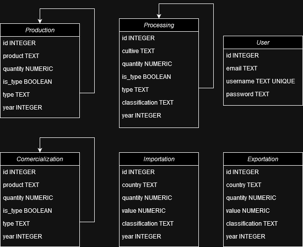

# Tech Challenge - API FastAPI

## Descrição

Este é um projeto desenvolvido como parte do desafio da pós-graduação, referente à atividade da 1ª fase do curso. O projeto é uma API construída com FastAPI e documentada com Swagger. A API realiza um scraping no site da Embrapa (http://vitibrasil.cnpuv.embrapa.br/).

## Funcionalidades

- Realiza scraping de dados do site da Embrapa.
- Documentação interativa com Swagger.

## Pré-requisitos

- Python 3.10 ou superior

## Instalação

### Linux e macOS

1. Clone o repositório:
   ```sh
   git clone 
   cd repo

2. Crie um ambiente virtual:
   ```sh
   python3 -m venv venv

3. Ative o ambiente virtual:
   ```sh
   source venv/bin/activate

4. Instale as dependencias:
   ```sh
   pip install -r requirements.txt

### Windows

1. Clone o repositório:
   ```sh
   git clone 
   cd repo

2. Crie um ambiente virtual:
   ```sh
   python -m venv venv

3. Ative o ambiente virtual:
   ```sh
   .\venv\Scripts\activate

4. Instale as dependencias:
   ```sh
   pip install -r requirements.txt

## Sobre esse projeto

É uma API simples que realiza um scraping no site da emprapa. A api possúi 5 endpoints get simples com os dados capturados, além das duas rotas para criação e autenticação de um usuário. Após a captura dos dados as informações são salvas em um banco de dados SQLite. Esse banco relacional segue as regras definidas pelo Diagrama de Entidade e Relacionamento abaixo:





Sobre as rotas:

### /register

Rota utilizada para cadastrar um usuário, utilizando as informações de _username_, _email_ e _password_ informadas no corpo da requisição, sendo todos os parâmetros obirgatórios, seguindo também algumas validações como email válido, quantidade de caractéres, e unicidade do username.

### /token

Rota que retorna o token de acesso, permitindo acessar as rotas protegidas, é unica rota que utiliza-se de uma requisição _x-www-form-urlencoded_, conforme documentação do fastapi, para autenticação, utiliza o email e password informados na rota register para criação de um token jwt.

### /production

Rota que recebe um parametro query, informada no cabeçalho da requisição. O parâmetro informado é o ano, que obedece algumas validações como o ano estar entre 1970 e 2023, anos em que o site da embrapa possúi dados gerados.

### /processing

Rota que recebe dois parâmetros, sendo somente um deles obrigatório, o ano, que assim como na rota de prodution, deve estar entre um ano inicio e um ano fim conforme a disponibilidade dos dados no site da embrapa. O parâmetro classification é opcional, quando não informado retorna todas as informações indiferente da classificação. Quando informado, filtra o resultado pela classificação informada.

Embora seja possível filtar a busca com o classification, caso o ano informado não tenha informações salvas no banco, o scraping será realizado para todas as classificações dessse ano, salvando-as no banco, e somente o reultado final será filtrado.

### /commercialization

Rota que recebe o parâmetro ano como query do cabeçalho. obedece algumas validações, e consulta no site da emprapa quando não possui os dados salvos no banco local, caso possua somente retorna os dados já carregados anteriormente.

### /importation

Rota que retorna as importações referente ao ano informado como parâmetro, caso ainda não tenho no banco local realiza o scraping. Além do ano, recebe o parâmetro opcinal da classificação.

### /exportation

Rota que retornar as exportações refernte ao ano informado, manteando também o parâmetro opcional de classficação, filtriando por ele quando informado.